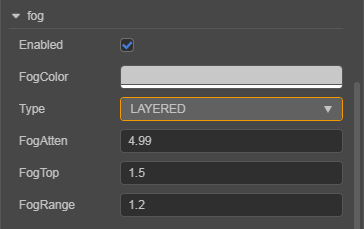

# Global Fog

Global fog is used to simulate fog effects in outdoor environments in video games. In addition to fog representation in video games, it can also be used to hide the model outside the camera's far clipping plane to improve rendering performance.

Check **Scene** in the **Hierarchy** panel, then check the **Enabled** property in the **Fog** component of the **Inspector** panel to enable global fog.

## Types of Global Fog

The types of global fog depend on the result of the calculation of **Camera** and **Model Vertices**, which is called the **Fog Blend Factor**. The fog blend factor determines how the fog colors and model colors are blended, resulting in a different global fog effect. Currently there are four fog types including **LINEAR**, **EXP**, **EXP_SQUARED**, and **LAYERED**.

### Linear

| Properties | Description |
| :---| :--- |
| **Enabled** | Whether to enable the global fog |
| **FogColor** | The color of the global fog |
| **Type** | The type of the global fog |
| **FogStart** | The starting position of the fog effect |
| **FogEnd** | The end position of the fog effect |

The fog blend factor of Linear Fog is calculated by the following formula:

**f = (FogEnd - Cam_dis) / (FogEnd - FogStart)**

- When `Cam_dis = FogEnd`, i.e., the distance between the camera and the model vertex is equal to FogEnd, the blend factor is calculated as 0, and the object is fully fogged.

- When `Cam_dis = FogStart`, i.e. the distance between the camera and the model vertex is equal to FogStart, the blend factor is calculated as 1, and the object is not affected by fogging.

To increase the density of Linear Fog when the distance between the camera and the model vertex is fixed, there are two ways:

1. fix the value of `FogStart` and decrease the value of `FogEnd`.
2. Decrease the value of `FogStart` and fix the value of `FogEnd`.

If you want to adjust the fog effect to the right consistency, it is best to adjust both the `FogStart` and `FogEnd` properties appropriately. A example effect of Linear Fog is shown below：

### Exponential and Exponential Squared

| Properties | Description |
| :---| :--- |
| **Enabled** | Whether to enable the global fog |
| **FogColor** | The color of the global fog |
| **Type** | The type of the global fog |
| **FogDensity** | The fog density, in the range 0 ~ 1 |
| **FogAtten** | Fog attenuation coefficient |

The fog blend factor for Exponential Fog is calculated as

**f = e^(-distance * fogDensity)**

The fog blend factor for Exponential Squared Fog is calculated as

**f = e^(-distance * fogDensity)²**

Developers can use `FogDensity` and `FogAtten` to adjust the density of global fog at different locations.

An example effect of Exponential Fog is shown below.

### Layered

Layered Fog is parallel to the horizontal plane and has a certain height. The height of the fog can be determined by setting the top of the Layered Fog at any position in the vertical direction of the scene world coordinate system.

| Property | Description |
| :---| :--- |
| **Enabled** | Whether to enable the global fog |
| **FogColor** | The color of the global fog |
| **Type** | The fog type of the global fog |
| **FogAtten** | Fog attenuation coefficient |
| **FogTop** | The position of the model vertices in the vertical direction of the world coordinate system, below which all vertices will be affected by the fog effect |
| **FogRange** | The range of the fog effect |

The fog calculation of Layered Fog is a bit more complicated than the previous three fog types, as it introduces the concept of `FogTop` and also requires distance calculation in the **x-z** plane.

Layered Fog is more common in reality, with towering mountains and buildings. If it is used wisely, it is believed to have a good effect on scene presentation, but at the same time, the computation will be increased, so developers can decide according to their needs.

The example effect of Layered Fog is as follows.

