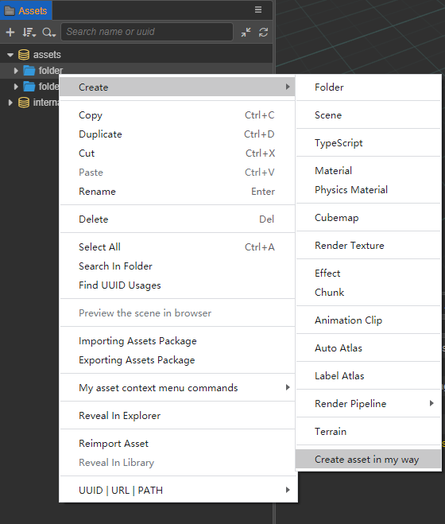

# 扩展资源管理器面板

## 扩展右击菜单

右击菜单的显示机制，是在显示之前获取实时的菜单数据。插件预先在自己的 `package.json` 中注册 `assets` 模块，就能获取 **资源管理器** 面板的右击菜单显示事件，并通过事件返回要显示的菜单数据，然后再统一显示出来。注册完成的菜单一般显示在现有菜单的后面。

假设 **资源管理器** 面板的某个位置 (`where`) 有右击菜单事件，目前支持扩展的位置 (`where`) 有：

- 'create' -- 创建资源的两个入口: 一是面板头部上的 '+' 图标；二是右击菜单里的 'Create'。
- 'db' -- 资源根节点上
- 'asset' -- 资源普通节点上
- 'plain' -- 面板空白区域上

具体实现步骤：

- 在编辑器顶部的菜单栏中选择 **扩展** --> **创建扩展**，根据需要在 **全局/项目** 目录下新建一个插件。插件包就会生成在根目录/项目目录的 `extensions` 目录下。
- 打开插件包的 `package.json` 文件，然后在 `contributions.assets.menu` 中引入一个 js 文件 `./assets-menu.js`

```json
{
  "contributions": {
    "assets": {
      "menu": "./assets-menu.js"
    }
  }
}
```

- 然后在插件包中新建一个 `assets-menu.js` 文件，文件内容可参考下文。`assets-menu.js` 文件中有一个显示事件，是约定好名称的函数 `show(where, assetInfo){ }` ，它会被调用并返回菜单数组数据。

```typescript
// assets-menu.js
export function show(where: MenuWhere, assetInfo: MenuAssetInfo): MenuItem[] {
  switch (where) {
    case MenuWhere.Create: {
      return [
        {
          label: 'i18n:extend-assets-demo.menu.createAsset',
          click() {
            if (!assetInfo) {
              console.log('get create command from header menu');
            } else {
              console.log(
                'get create command, the detail of diretory asset is:'
              );
              console.log(assetInfo);
            }
          },
        },
      ];
    }
    case MenuWhere.Asset: {
      return [
        {
          label: 'i18n:extend-assets-demo.menu.assetCommandParent',
          submenu: [
            {
              label: 'i18n:extend-assets-demo.menu.assetCommand1',
              enabled: assetInfo.isDirectory,
              click() {
                console.log('get it');
                console.log(assetInfo);
              },
            },
            {
              label: 'i18n:extend-assets-demo.menu.assetCommand2',
              enabled: !assetInfo.isDirectory,
              click() {
                console.log('yes, you clicked');
                console.log(assetInfo);
              },
            },
          ],
        },
      ];
    }
    case MenuWhere.DB: {
      return [
        {
          label: 'i18n:extend-assets-demo.menu.dbCommand1',
          click() {
            console.log('clicked db command 1');
          },
        },
        {
          label: 'i18n:extend-assets-demo.menu.dbCommand2',
          click() {
            console.log('clicked db command 2');
          },
        },
      ];
    }
    case MenuWhere.Plain: {
      return [
        {
          label: 'i18n:extend-assets-demo.menu.plainCommand1',
          message: 'create-asset',
          click() {
            console.log('clicked on the plain area in the panel.');
          },
        },
      ];
    }
    default:
      return [];
  }
}
```

`上述 show() 函数参数说明`

```typescript
export enum MenuWhere {
  Create: 'create',
  DB: 'db',
  Asset: 'asset',
  Plain: 'plain'
}

export interface MenuItem {
  type?: string;
  label?: string;
  sublabel?: string;
  submenu?: MenuItem[];
  click?: Function;
  enable?: Boolean;
  visible?: boolean;
  accelerator?: string;
  checked?: boolean;
  /**
   * 更多参数请查阅
   * https://www.electronjs.org/docs/api/menu-item
   */
}

export interface MenuAssetInfo extends AssetInfo {
  additional: IDragAdditional[]; // 追加可识别的拖拽类型
  fileName: string; // 文件名，不包含后缀
  fileExt: string; // 后缀，不包含点号
  isParent: boolean; // 是否是父节点
  isDB: boolean; // 是否是 DB 根节点
  isSubAsset: boolean; // 是否是 subAsset, 是的话：无右击菜单，可拖动到 scene 或 hierarchy, 但 asset 面板里面的不能移动
  depth: number; // 树形层级
  left: number; // 缩进的大小
  refreshTime: number; // 每次刷新的当前时间戳，目前用于缩略图的刷新
}

export interface AssetInfo {
  // Asset name
  // 资源名字
  name: string;
  // Asset display name
  // 资源用于显示的名字
  displayName: string;
  // URL
  source: string;
  // loader 加载的层级地址
  path: string;
  // loader 加载地址会去掉扩展名，这个参数不去掉
  url: string;
  // 绝对路径
  file: string;
  // 资源的唯一 ID
  uuid: string;
  // 使用的导入器名字
  importer: string;
  // 类型
  type: string;
  // 是否是文件夹
  isDirectory: boolean;
  // 导入资源的 map
  library: { [key: string]: string };
  // 子资源 map
  subAssets: { [key: string]: AssetInfo };
  // 是否显示
  visible: boolean;
  // 是否只读
  readonly: boolean;

  // 虚拟资源可以实例化成实体的话，会带上这个扩展名
  instantiation?: string;
  // 跳转指向资源
  redirect?: IRedirectInfo;
  // 继承类型
  extends?: string[];
  // 是否导入完成
  imported: boolean;
  // 是否导入失败
  invalid: boolean;
}
```



## 扩展拖入识别

识别一个可被接受的类型，需要编辑器 UI 组件 `<ui-drag-item>` 的支持，其中一个重要的属性是 `type`, `<ui-drag-item type="xxx">`。自定义一个拖入类型，并注入到 **资源管理器** 面板的识别范围内，后续在编辑器其他面板拖入进 **资源管理器** 面板时，**资源管理器** 面板便能识别到它，并给类型的注册方（插件）发送消息，注册方便能执行一个自定义的动作，比如执行新建一组资源。

具体实现步骤，大致跟上述的菜单扩展一样，打开插件的 `package.json` 文件做对应的配置。

`package.json`

```json
{
  "contributions": {
    "drop": [
      {
        "type": "my-defined-asset-type-for-drop",
        "message": "drop-asset"
      }
    ]
  },
  "messages": {
    "drop-asset": {
      "methods": ["default.dropAsset"] // 'default' 是指当前插件的默认面板
    }
  }
}
```

下方 **Demo 示例** 中的范例有一个 `panle.js` 文件，是面板的渲染进程，如下所示：

```typescript
exports.methods = {
  dropAsset(assetInfo: DropCallbackInfo, dragInfo: any) {
    console.log('get drop callback params: ', assetInfo, dragInfo);
  },
};
```

```html
<ui-drag-item
  type="my-defined-asset-type-for-drop"
  additional='{"value":"this additional is dragInfo data."}'
>
  <ui-label>Drag me to assets panel, and look conosole log.</ui-label>
</ui-drag-item>
```

`panle.js` 文件中 `dropAsset()` 方法的参数说明如下：

```typescript
export interface DropCallbackInfo {
  uuid: string; // 拖放到该资源上，该资源的 uuid
  type: string; // 该资源的类型
  isDirectory: boolean; // 该资源是否是文件夹
}
```

## Demo 示例

两个扩展功能的可执行代码可下载 <a href="img/extend-assets.zip" target="_blank">范例</a> 查看
